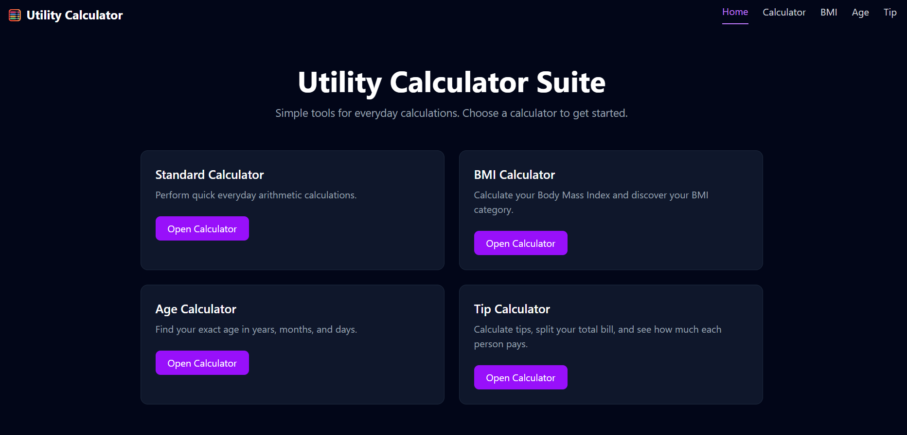
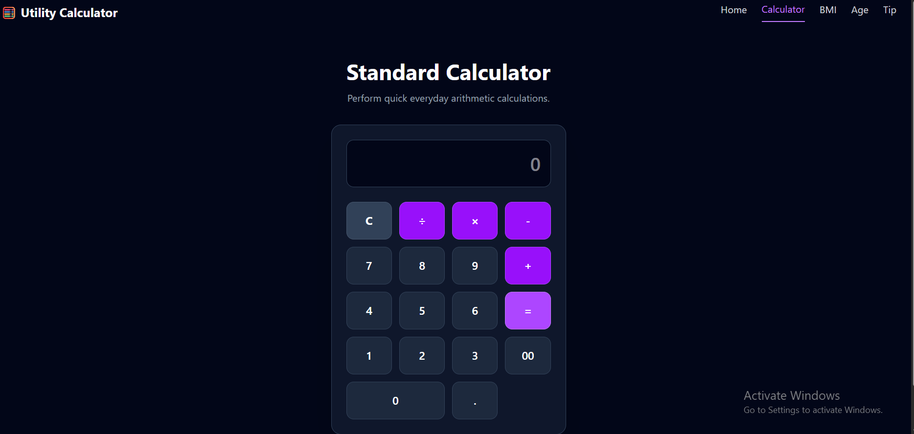
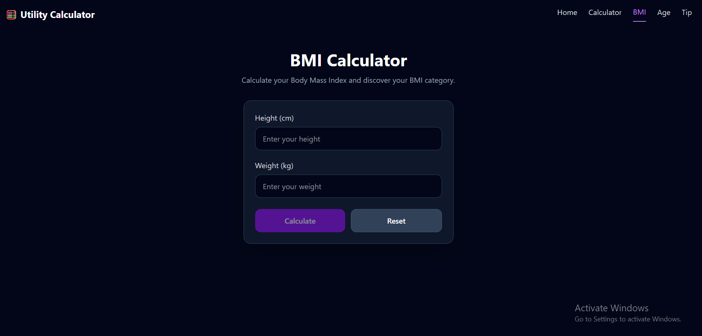
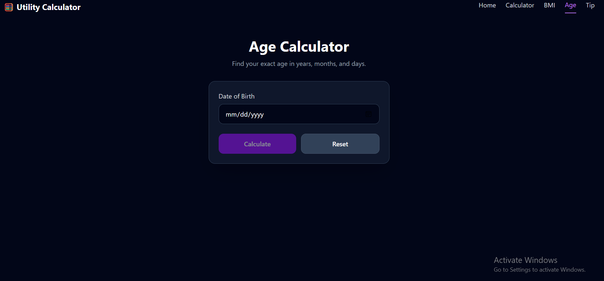
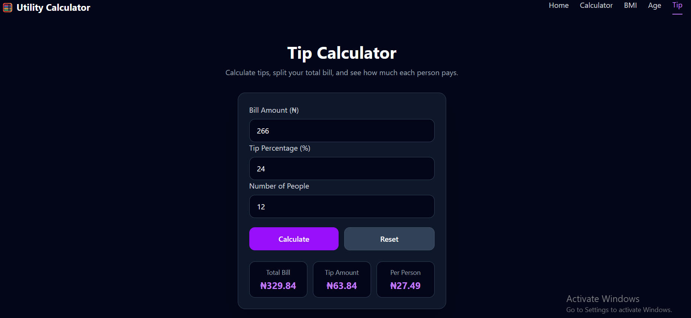

# 🧮 Utility Calculator Suite

A responsive utility calculator suite built with React and Tailwind CSS. The application provides four useful calculators in one simple and user-friendly interface.

## 🔗 Live Demo

[View Live Application](https://utility-calculator-suite.vercel.app/)

## ✨ Features

- Standard Calculator – Perform basic arithmetic calculations.
- BMI Calculator – Calculate Body Mass Index and view the corresponding BMI category.
- Age Calculator – Calculate exact age in years, months, and days.
- Tip Calculator – Calculate tip amounts, total bills, and split payments between multiple people.
- Responsive design for mobile and larger screens.
- Easy navigation between calculators.

## 🛠️ Built With

- React
- JavaScript
- Tailwind CSS
- Vite

## 📚 What I Learned

While building this project, I practiced:

- React components
- React `useState`
- Props and passing functions between components
- Conditional rendering
- Event handling
- Form inputs and validation
- JavaScript calculations and date handling
- Responsive design with Tailwind CSS
- CSS Grid and Flexbox
- Git and GitHub version control

## 🚀 Getting Started

Clone the repository:

```bash
git clone https://github.com/olajideIfe/utility-calculator-suite.git
```

Navigate to the project folder:

```bash
cd utility-calculator-suite
```

Install the dependencies:

```bash
npm install
```

Start the development server:

```bash
npm run dev
```

## 📸 Screenshots

### Home Page


### Standard Calculator


### BMI Calculator


### Age Calculator


### Tip Calculator


## 🔮 Future Improvements

- Add more utility calculators
- Add light and dark mode
- Improve animations and transitions
- Add keyboard support to the standard calculator
- Add additional input validation

## 👩‍💻 Author

Built by Ifedolapo Olajide as part of my journey learning React and modern frontend development.